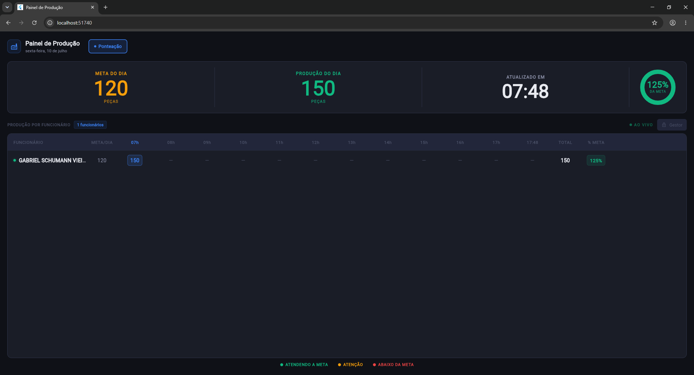
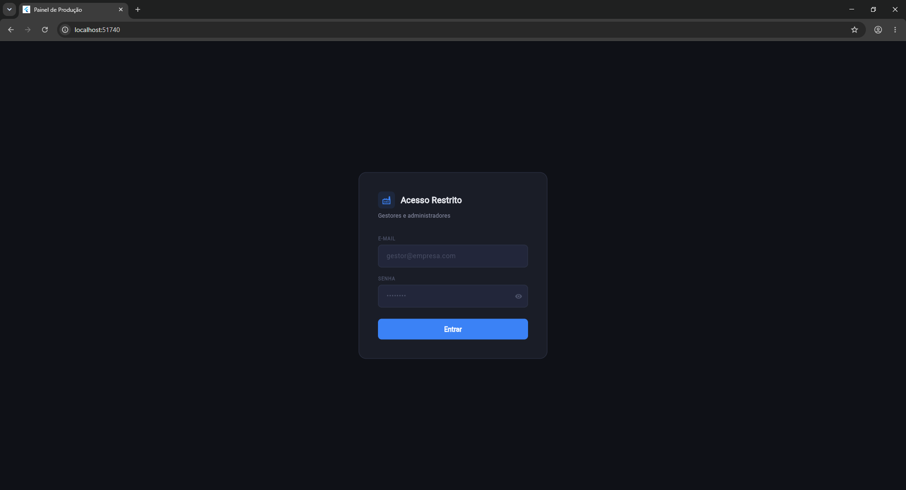
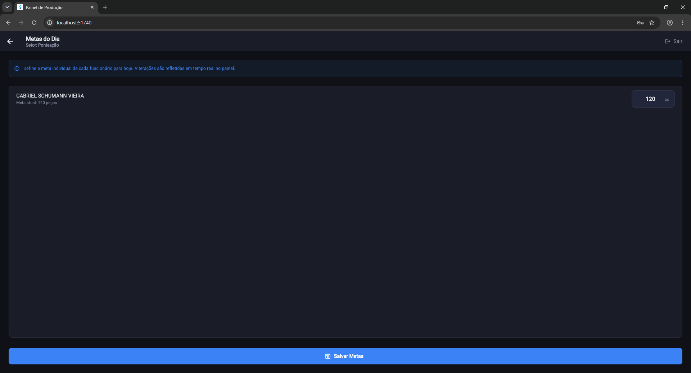

# Painel Produção

Painel de produção em tempo real para TVs de chão de fábrica, conectado à mesma base de dados usada pelo sistema de apontamento.

## Sobre o projeto

Exibe o andamento da produção do dia por setor e por funcionário, com metas, produção acumulada por hora e percentual atingido, atualizado automaticamente a partir do Firestore.

## Funcionalidades

- KPIs no topo: Meta do Dia e Produção do Dia, com gráfico de rosca mostrando o percentual da meta
- Seletor de setores em abas, carregado dinamicamente do Firebase
- Tabela por funcionário com produção acumulada em cada hora do turno e total do dia
- Indicador de percentual da meta por funcionário (verde, azul, amarelo ou vermelho conforme a faixa atingida)
- Relógio em tempo real e indicador de atualização ao vivo
- Atualização automática via streams do Firestore

## Screenshots

### Painel de Produção
Visão em tempo real da produção do dia, com KPIs, gráfico de meta e tabela por funcionário e por hora. Fica exibido continuamente na TV do setor.



### Acesso Restrito (Login)
Tela de login exibida apenas quando o gestor deseja alterar as metas dos funcionários, protegendo a edição contra acesso não autorizado.



### Metas do Dia
Após autenticação, o gestor define a meta individual de cada funcionário. Alterações são refletidas em tempo real no painel.



## Tecnologias

- Flutter
- Firebase (Cloud Firestore, Firebase Auth)
- Dart

## Estrutura do projeto

```text
lib/
  main.dart
  app_theme.dart
  models/
    marco_model.dart
    producao_model.dart
  screens/
    login_screen.dart
    metas_screen.dart
    painel_producao_screen.dart
  services/
    auth_service.dart
    producao_service.dart
    snapshot_service.dart
  widgets/
    donut_kpi_card.dart
    setor_tab_bar.dart
    tabela_producao.dart
```

## Configuração

Este repositório não inclui as credenciais do Firebase (firebase_options.dart, google-services.json, firebase.json, .firebaserc), por questões de segurança.

Para rodar o projeto localmente:

1. Crie um projeto no [Firebase Console](https://console.firebase.google.com/)
2. Habilite o Cloud Firestore e, se necessário, o Firebase Authentication
3. Instale o FlutterFire CLI e gere seu próprio arquivo de configuração:

```bash
flutterfire configure
```

4. Rode o projeto:

```bash
flutter pub get
flutter run -d chrome
```

## Observação

Este painel foi projetado para consumir a mesma base de dados (`producao_ativa`) usada pelo app de apontamento de chão de fábrica, exibindo os dados em tempo real nas TVs do setor.

## Status

Projeto em desenvolvimento ativo.